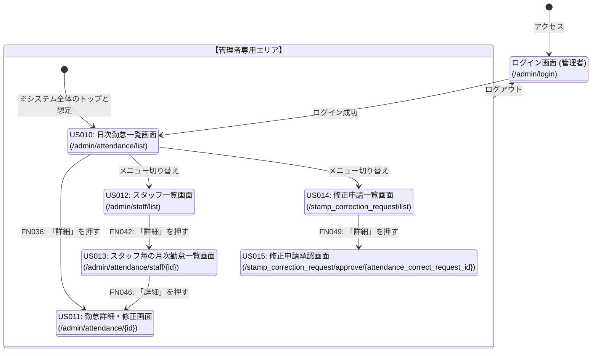

```mermaid
stateDiagram-v2
    classDef unauth fill:#fff,stroke:#333,stroke-width:2px;
    classDef admin fill:#c8e6c9,stroke:#388e3c,stroke-width:2px;

    [*] --> 管理者_ログイン画面 : アクセス

    state "ログイン画面 (管理者)\n(/admin/login)" as 管理者_ログイン画面:::unauth

    state "【管理者専用エリア】" as 管理者エリア {
        state "US012: スタッフ一覧画面\n(/admin/staff/list)" as スタッフ一覧:::admin
        state "US013: スタッフ毎の月次勤怠一覧画面\n(/admin/attendance/staff/{id})" as 月次勤怠一覧:::admin
        state "US010: 日次勤怠一覧画面\n(/admin/attendance/list)" as 日次勤怠一覧:::admin
        state "US011: 勤怠詳細・修正画面\n(/admin/attendance/{id})" as 勤怠詳細:::admin
        state "US014: 修正申請一覧画面\n(/stamp_correction_request/list)" as 申請一覧:::admin
        state "US015: 修正申請承認画面\n(/stamp_correction_request/approve/{attendance_correct_request_id})" as 承認画面:::admin

        [*] --> 日次勤怠一覧 : ※システム全体のトップと想定
        
        %% 表の通りにルートを修正
        スタッフ一覧 --> 月次勤怠一覧 : FN042: 「詳細」を押す
        月次勤怠一覧 --> 勤怠詳細 : FN046: 「詳細」を押す
        日次勤怠一覧 --> 勤怠詳細 : FN036: 「詳細」を押す
        申請一覧 --> 承認画面 : FN049: 「詳細」を押す
        
        %% その他想定されるメニュー遷移など
        日次勤怠一覧 --> スタッフ一覧 : メニュー切り替え
        日次勤怠一覧 --> 申請一覧 : メニュー切り替え
    }

    管理者_ログイン画面 --> 日次勤怠一覧 : ログイン成功
    管理者エリア --> 管理者_ログイン画面 : ログアウト
```