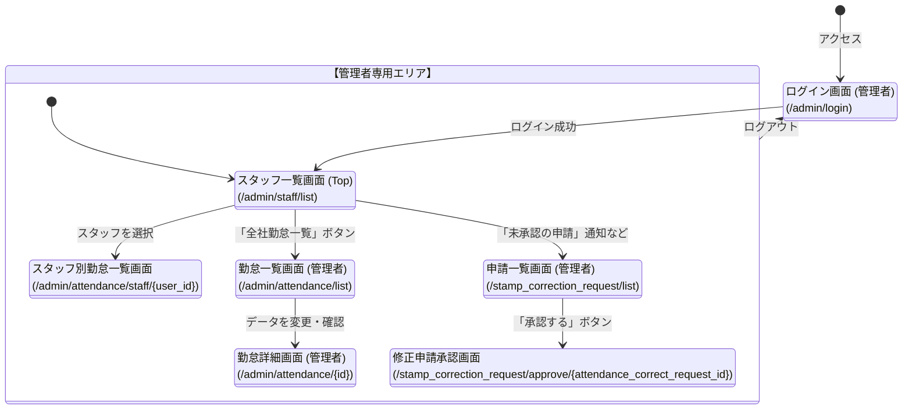

```mermaid
stateDiagram-v2
    classDef unauth fill:#fff,stroke:#333,stroke-width:2px;
    classDef admin fill:#c8e6c9,stroke:#388e3c,stroke-width:2px;

    [*] --> 管理者_ログイン画面 : アクセス

    state "ログイン画面 (管理者)\n(/admin/login)" as 管理者_ログイン画面:::unauth

    state "【管理者専用エリア】" as 管理者エリア {
        state "スタッフ一覧画面 (Top)\n(/admin/staff/list)" as スタッフ一覧:::admin
        state "スタッフ別勤怠一覧画面\n(/admin/attendance/staff/{user_id})" as スタッフ別勤怠:::admin
        state "勤怠一覧画面 (管理者)\n(/admin/attendance/list)" as 勤怠一覧_G:::admin
        state "勤怠詳細画面 (管理者)\n(/admin/attendance/{id})" as 勤怠詳細_G:::admin
        state "申請一覧画面 (管理者)\n(/stamp_correction_request/list)" as 申請一覧_G:::admin
        state "修正申請承認画面\n(/stamp_correction_request/approve/{attendance_correct_request_id})" as 承認画面:::admin

        [*] --> スタッフ一覧
        スタッフ一覧 --> スタッフ別勤怠 : スタッフを選択
        スタッフ一覧 --> 勤怠一覧_G : 「全社勤怠一覧」ボタン
        勤怠一覧_G --> 勤怠詳細_G : データを変更・確認
        スタッフ一覧 --> 申請一覧_G : 「未承認の申請」通知など
        申請一覧_G --> 承認画面 : 「承認する」ボタン
    }

    管理者_ログイン画面 --> スタッフ一覧 : ログイン成功
    管理者エリア --> 管理者_ログイン画面 : ログアウト
```