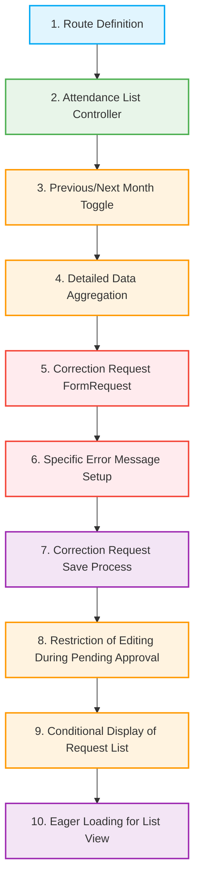

```mermaid
flowchart TD
    %% 共通スタイルの定義
    classDef routing fill:#e1f5fe,stroke:#03a9f4,stroke-width:2px;
    classDef controller fill:#e8f5e9,stroke:#4caf50,stroke-width:2px;
    classDef logic fill:#fff3e0,stroke:#ff9800,stroke-width:2px;
    classDef validation fill:#ffebee,stroke:#f44336,stroke-width:2px;
    classDef database fill:#f3e5f5,stroke:#9c27b0,stroke-width:2px;

    %% フローの定義
    task1[1. Route Definition] --> task2[2. Attendance List Controller]
    task2 --> task3[3. Previous/Next Month Toggle]
    task3 --> task4[4. Detailed Data Aggregation]
    task4 --> task5[5. Correction Request FormRequest]
    task5 --> task6[6. Specific Error Message Setup]
    task6 --> task7[7. Correction Request Save Process]
    task7 --> task8[8. Restriction of Editing During Pending Approval]
    task8 --> task9[9. Conditional Display of Request List]
    task9 --> task10[10. Eager Loading for List View]

    %% スタイルの適用
    class task1 routing;
    class task2 controller;
    class task3,task4,task8,task9 logic;
    class task5,task6 validation;
    class task7,task10 database;
```