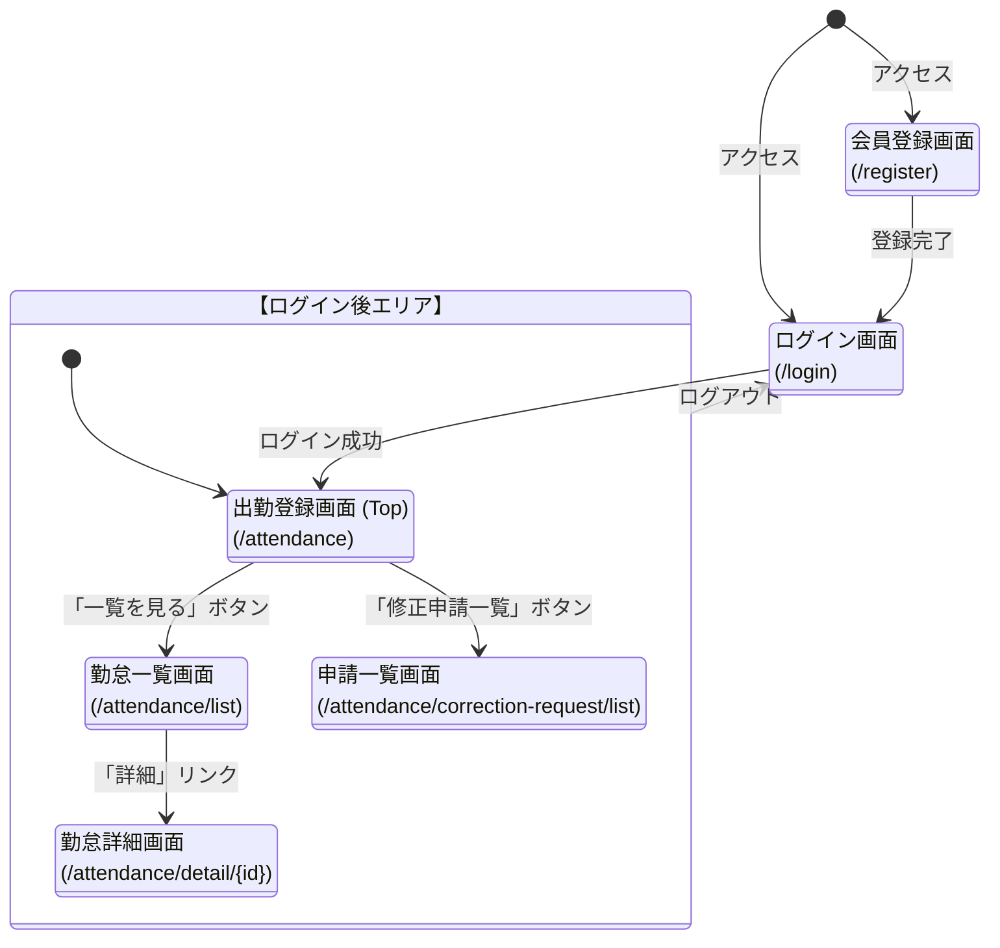

```mermaid
stateDiagram-v2
    %% スタイル定義
    classDef unauth fill:#fff,stroke:#333,stroke-width:2px;
    classDef user fill:#fff9c4,stroke:#fbc02d,stroke-width:2px;

    [*] --> 会員登録画面 : アクセス
    [*] --> ログイン画面 : アクセス

    state "会員登録画面\n(/register)" as 会員登録画面:::unauth
    state "ログイン画面\n(/login)" as ログイン画面:::unauth

    会員登録画面 --> ログイン画面 : 登録完了

    state "【ログイン後エリア】" as ログイン後エリア {
        state "出勤登録画面 (Top)\n(/attendance)" as 出勤登録画面:::user
        state "勤怠一覧画面\n(/attendance/list)" as 勤怠一覧画面:::user
        state "勤怠詳細画面\n(/attendance/detail/{id})" as 勤怠詳細画面:::user
        state "申請一覧画面\n(/attendance/correction-request/list)" as 申請一覧画面:::user

        [*] --> 出勤登録画面
        出勤登録画面 --> 勤怠一覧画面 : 「一覧を見る」ボタン
        勤怠一覧画面 --> 勤怠詳細画面 : 「詳細」リンク
        出勤登録画面 --> 申請一覧画面 : 「修正申請一覧」ボタン
    }

    ログイン画面 --> 出勤登録画面 : ログイン成功
    ログイン後エリア --> ログイン画面 : ログアウト
```